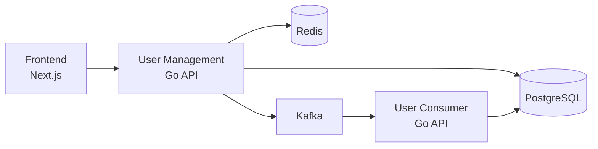

<div align="center">
  <h1>🚀 Full-Stack Architecture</h1>
</div>

## ⚡️ Tech Stack

- **Frontend**: Next.js 15 with TypeScript
- **Backend**: Go 1.23 Microservices
- **Database**: PostgreSQL with persistent storage
- **Cache**: Redis
- **Message Queue**: Kafka
- **Deployment**: Docker & Docker Compose

## 🏗 Architecture



## 🛠 Development

### Prerequisites
- Docker & Docker Compose
- Make

### Quick Start
Start all services
```bash
make docker-up
```

Start individual services
```bash
make be-docker-up # Backend
make fe-docker-up # Frontend
```


### Service URLs
- Frontend: http://localhost:3000
- User Management API: http://localhost:8082
- User Consumer API: http://localhost:8081